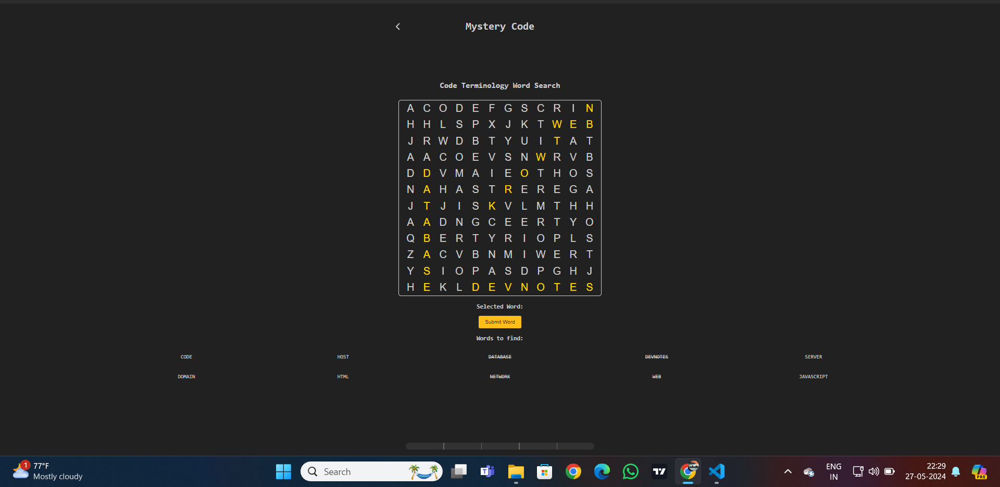
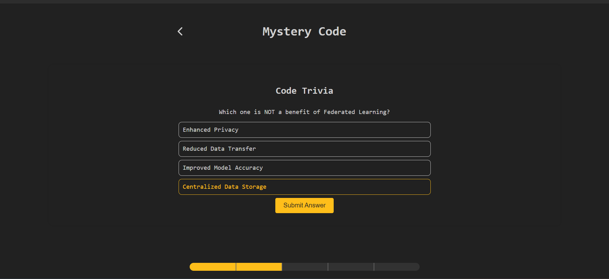

# Mystery Code

Mystery Code is a mystery-revealing scavenger hunt website that contains five minigames for developers to have a little fun.

## Table of Contents
- [Features](#features)
- [Screenshots](#screenshots)
- [Installation](#installation)
- [Usage](#usage)
- [Technologies](#technologies)
- [Contributing](#contributing)
- [License](#license)

## Features
- **Word Search**: Find words related to coding in a grid.
- **Decryption Challenge**: Decode an encrypted message to progress.
- **Memory Card Game**: Match pairs of cards with identical symbols.
- **Riddle Reveal**: Answer a riddle related to coding and select the right digital box.
- **Trivia Quiz**: Answer questions to test your knowledge in federated learning.

## Screenshots
### Home Screen

### Word Search

### Decryption Challenge

### Completion Message

### Code Trivia

### Memory Card Game

### Riddle Reveal


## Installation
To get a local copy up and running, follow these steps:

### Prerequisites
- Node.js
- npm

### Installation Steps
1. Clone the repository:
   ```sh
   git clone https://github.com/your-username/mystery-code.git
